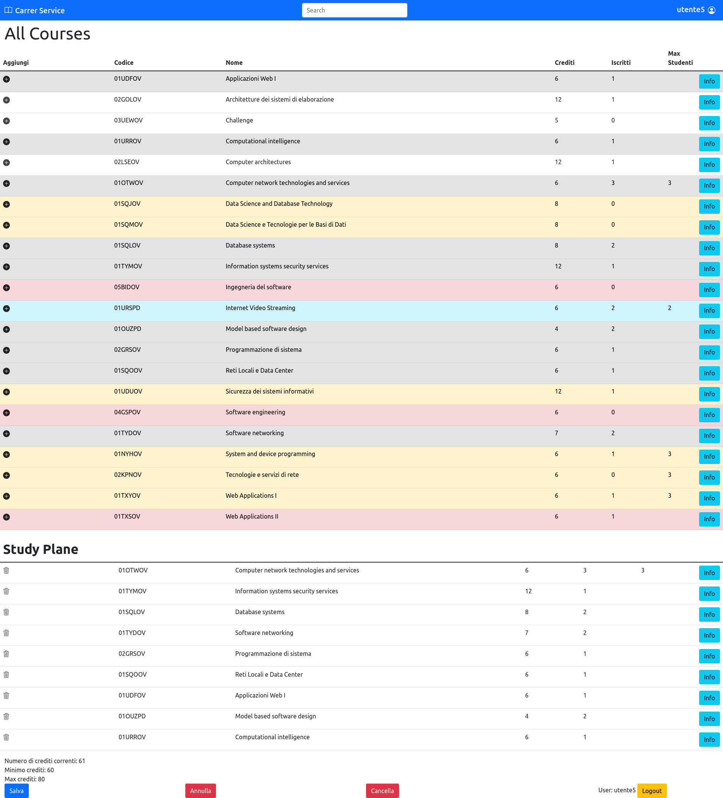

# Exam #1: "Piano di studi"
## Student: s302320 VOLPINI LEONARDO 

## React Client Application Routes

- Route `/`: pagina iniziale che manda alla route /home/logged in caso di login effettuato, altrimenti manda a /home
- Route `/login`: pagina contenente il componente LoginForm per effettuare il login
- Route `/home`: pagina contenente il componente CourseLibrary, per mostrare la lista dei corsi e le relative informazioni, e LoginButton che serve per andare alla route /login
- Route `/home/logged`: pagina contenente il componente CourseLibrary (per mostrare la lista dei corsi e le relative informazioni), LogoutBotton (permette di effetturare il logut e tornare a /home) e due possibili diverse visualizzazioni in caso di piano di studi esistente o meno: 1) piano di studi esistente -> componente StudyPlane che mostra i corsi del piano di studi e le relative info, Salva Annulla Cancella che sono 3 componenti per effettuare le diverse operazioni sul piano di studi; 2) piano di studi non esistente -> componente CreateStudyPlane con il form per la creazione del piando di studi
- Route `/*`: ruote generica che rimanda alla /home in caso di url non considerata

## API Server

- GET `/api/courses`
  - Description: Ottenere l'intera lista dei corsi 
  - Request body: _None_
  - Response: `200 OK` (success) 
  - Response body: Array di oggetti, ognuno descrivente un corso:
    ``` json
    [
      {
        "code": "01UDFOV",
        "nome": "Applicazioni Web I",
        "crediti": 6,
        "maxStudenti": null,
        "iscritti": 1,
        "propedeuticita": null
      },
      ...
      {
        "code": "01OTWOV",
        "nome": "Computer network technologies and services",
        "crediti": 6,
        "maxStudenti": 3,
        "iscritti": 3,
        "propedeuticita": null
      },
      ...
      {
        "code": "05BIDOV",
        "nome": "Ingegneria del software",
        "crediti": 6,
        "maxStudenti": null,
        "iscritti": 0,
        "propedeuticita": "02GOLOV"
      },
      ...
    ]
    ```
  - Error responses: `500 Internal Server Error` (database error)

- GET `/api/courses/:code/incompatibilita`
  - Description: Ottenere l'intera lista dei codici dei corsi incompatibili con il corso passato come parametro
  - Request parameters: codice di un corso 
  - Request body: _None_
  - Response: `200 OK` (success) 
  - Response body: Array di stringhe contenenti il codice di un corso, o nulla:
    ``` json
    [
      "01SQJOV",
      "01SQMOV",
      ...
    ]
    ```
  - Error responses: `500 Internal Server Error` (database error), `404 Not Found` (unavailable)
  
- POST `/api/studyplane/addAll`
  - Description: Aggiungere un array di corsi al piano di studi di un utente loggato
  - Request body: Array di oggetti, ognuno descrivente un corso:
    ``` json
    [
      {
        "code": "04GSPOV",
        "nome": "Software engineering",
        "crediti": 6,
        "maxStudenti": null,
        "iscritti": 1,
        "propedeuticita": "02LSEOV",
        "incompatibilita": ["05BIDOV",...],
        "inc": false,
        "prop": false,
        "sel": true
      },
      ...
      {
        "code": "01TYDOV",
        "nome": "Software networking",
        "crediti": 7,
        "maxStudenti": null,
        "iscritti": 2,
        "propedeuticita": null,
        "inc": false,
        "prop": false,
        "sel": true
      },
      ...
    ]
    ```
  - Response: `200 OK` (success) 
  - Response body: _None_
  - Error responses: `503 Service unavailable` (database error), `422 Unprocessable Entity` (values do not satisfy validators), `409 Conflict` (violation of some constraints)

- DELETE `/api/studyplane`
  - Description: Eliminazione dei corsi di un piano di studi e del relativo piano di studi, per un utente loggato
  - Request body: Array di oggetti del piano di studi, ognuno descrivente un corso:
    ``` json
    [
      {
        "code": "04GSPOV",
        "nome": "Software engineering",
        "crediti": 6,
        "maxStudenti": null,
        "iscritti": 1,
        "propedeuticita": "02LSEOV",
        "incompatibilita": ["05BIDOV",...]
      },
      ...
      {
        "code": "01TYDOV",
        "nome": "Software networking",
        "crediti": 7,
        "maxStudenti": null,
        "iscritti": 2,
        "propedeuticita": null
      },
      ...
    ]
    ```
  - Response: `204 No Content` (success) 
  - Response body: _None_
  - Error responses: `503 Service unavailable` (database error), `422 Unprocessable Entity` (values do not satisfy validators), `409 Conflict` (violation of some constraints)

- DELETE `/api/studyplane/:code`
  - Description: Eliminazione di un corso da un piano di studi per un utente loggato
  - Request body: Il numero di crediti che saranno aggiunti in base al salvataggio dei nuovi corsi del piano di studi
    ``` json
    {
      "crediti": 13
    }
    ```
  - Response: `204 No Content` (success) 
  - Response body: _None_
  - Error responses: `503 Service unavailable` (database error), `422 Unprocessable Entity` (values do not satisfy validators), `409 Conflict` (violation of some constraints)

- GET `/api/studyplane`
  - Description: Ottenere l'intera lista dei corsi di un piano di studi per un utente loggato
  - Request body: _None_
  - Response: `200 OK` (success) 
  - Response body: Array di oggetti, ognuno descrivente un corso:
    ``` json
    [
      {
        "code": "01UDFOV",
        "nome": "Applicazioni Web I",
        "crediti": 6,
        "maxStudenti": null,
        "propedeuticita": null
      },
      ...
      {
        "code": "01OTWOV",
        "nome": "Computer network technologies and services",
        "crediti": 6,
        "maxStudenti": 3,
        "propedeuticita": null
      },
      ...
      {
        "code": "05BIDOV",
        "nome": "Ingegneria del software",
        "crediti": 6,
        "maxStudenti": null,
        "propedeuticita": "02GOLOV"
      },
      ...
    ]
    ```
  - Error responses: `500 Internal Server Error` (database error), `404 Not Found` (not present or unavailable)

- PUT `/api/studyplane/crediti`
  - Description: Aggiornamento dei crediti di un piano di studi per un utente loggato
  - Request body: Un oggetto contenente il nuovo valore dei crediti
    ``` json
    {
      "crediti": 65
    }
    ```
  - Response: `200 OK` (success) 
  - Response body: _None_
  - Error responses: `503 Service unavailable` (database error), `422 Unprocessable Entity` (values do not satisfy validators)

- GET `api/studyplane/crediti`
  - Description: Ottenere i crediti di un piano di studi per un utente loggato 
  - Request body: _None_
  - Response: `200 OK` (success) 
  - Response body: Un oggetto contente il valore dei crediti di un piano di studi
    ``` json
    {
      "crediti": 65
    }
    ```
  - Error responses: `500 Internal Server Error` (database error), `404 Not Found` (not present or unavailable)

- GET `api/studyplane/tipologia`
  - Description: Ottenere la tipologia di un piano di studi per un utente loggato
  - Request body: _None_
  - Response: `200 OK` (success) 
  - Response body: Un oggetto contente la tipologia di un piano di studi
    ``` json
    {
      "tipologia": "full-time"
    }
    ```
  - Error responses: `500 Internal Server Error` (database error), `404 Not Found` (not present or unavailable)

- POST `api/studyplane/tipologia`
  - Description: Creazione di un piano di studi con relativa tipologia
  - Request body: Un oggetto contenente la tipologia
    ``` json
    {
      "tipologia": "part-time"
    }
    ```
  - Response: `200 OK` (success) 
  - Response body: _None_
  - Error responses: `503 Service unavailable` (database error), `409 Conflict` (violation of some constraints)

- POST `/api/sessions`
  - Description: Autenticazione dell'utente che sta provando ad effettuare il login
  - Request body: Un oggetto contenente la tipologia
    ``` json
    {
    "username": "u1@p.it",
    "password": "password"
    }
    ```
  - Response: `200 OK` (success) 
  - Response body: utente autenticato
    ``` json
    {
    "id": 1,
    "username": "u1@p.it", 
    "name": "utente1"
    }
    ```
  - Error responses: `500 Internal Server Error` (generic error), `401 Unauthorized User` (login failed)

- GET `/api/sessions/current`
  - Description: Verifica se l'utente corrente è loggato e ottiene i suoi dati
  - Request body: _None_
  - Response: `200 OK` (success) 
  - Response body: utente autenticato
    ``` json
    {
    "id": 1,
    "username": "u1@p.it", 
    "name": "utente1"
    }
    ```
  - Error responses: `500 Internal Server Error` (generic error), `401 Unauthorized User` (login failed)

- DELETE `/api/sessions/current`
  - Description: Logout dell'utente corrente
  - Request body: _None_
  - Response: `200 OK` (success) 
  - Response body: _None_
  - Error responses: `500 Internal Server Error` (generic error), `401 Unauthorized User` (login failed)


## Database Tables

- Table `students` - contains: id (primary key), email, password, name, salt
  - tabella contenente i dati specifici di uno studente
- Table `courses` - contains: code (primary key), nome, crediti, maxStudenti, propedeuticita
  - tabella contenente tutti i corsi e alcune loro informazioni
- Table `incompatibility` - contains: course1 (primary key), course2 (primary key)
  - tabella contenete tutte le incompatibilità tra i vari corsi
- Table `infoStudyPlane` - contains: studentId (foreign key), tipologia, crediti
  - tabella contenente le informazioni generali dei piani di studi creati (piano di studi identificato dallo studente)
- Table `studyPlane` - contains: courseCode (foreign key), studentId (foreign key)
  - tabella contenente i corsi appartenenti a ciascun piano di studi (quindi a ciascun studente che lo abbia creato)

## Main React Components

- `Main` (in `Main.js`): sostanzialmente quello che dovrebbe stare in App, messo qui per utilizzare navigate. Qui dentro ci sono la maggior parte degli stati e delle parti di logica, messe qui per poterle passare poi a più componenti diverse tramite il componente RoutesManager
- `RoutesManager` (in `Routes.js`): componente che gestisce il layout dell'applicazione a seconda delle diverse routes
- `Loading` (in `Loading.js`): componente per il layout in fase di caricamento dei dati dal server
- `NavigationBar` (in `Navbar.js`): componente che mostra una navbar di estetica in alto nella pagina in caso di login effettuato
- `LoginForm` (in `LoginComponents.js`): componente che gestisce il form di login
- `CourseLibrary` (in `CourseComponents.js`): componente che mostra la lista di tutti i corsi e le relative informazioni, interagendo con i componenti minori CourseRow, CourseActions, CourseData, AddIcon
- `StudyPlane` (in `StudyPlaneComponents.js`): componente che mostra la lista di tutti i corsi, con le relative informazioni, appartenenti al piano di studi se quest'ultimo è stato creato; interagendo con i componenti minori CourseRow, CourseActions, CourseData, DeleteIcon
- `CreateStudyPlane` (in `CreateStudyPlaneComponents.js`): componente che gestisce il form per la creazione di un piano di studi

(only _main_ components, minor ones may be skipped)

## Screenshot



## Users Credentials

- email: "u1@p.it", password: "password", nessun piano di studi
- email: "u2@p.it", password: "password", part-time
- email: "u3@p.it", password: "password", full-time
- email: "u4@p.it", password: "password", nessun piano di studi
- email: "u5@p.it", password: "password", full-time